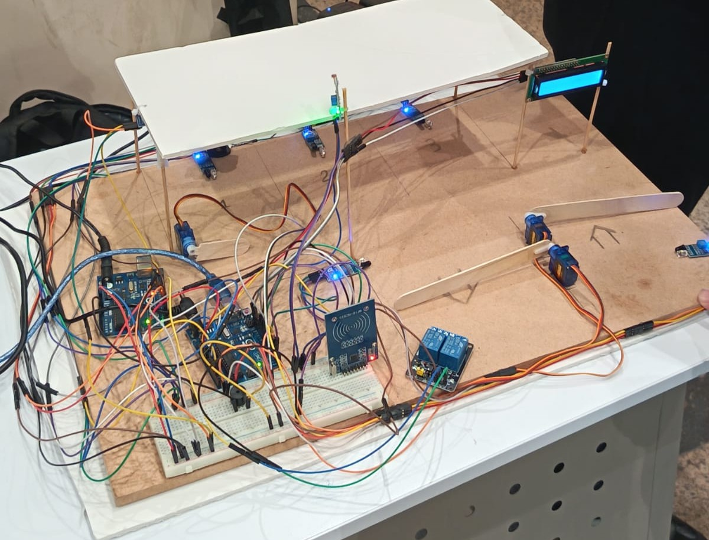
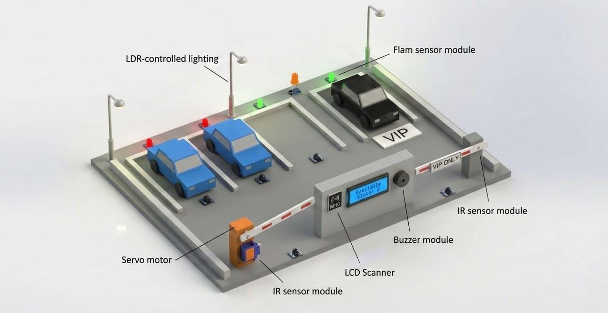
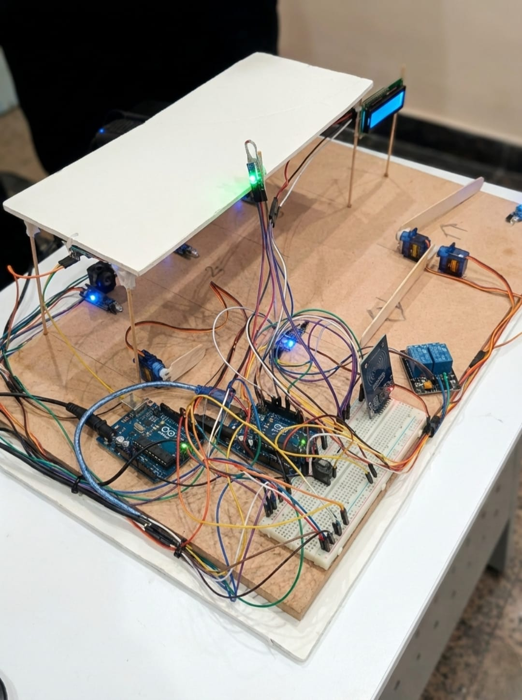
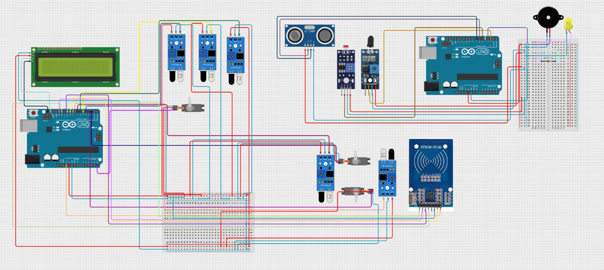

# ASPS – Automated Smart Parking System

> A smart parking system prototype integrating embedded systems, automation, and access control using Arduino-based hardware and real-time sensor interaction.



---

## Problem Statement

Traditional parking systems suffer from inefficient space management, lack of automated monitoring, and weak access control mechanisms. Drivers waste time searching for available parking spaces, while parking operators struggle to track occupancy and maintain safety.

ASPS addresses these challenges through an embedded systems prototype that combines automated gate control, RFID authentication, parking occupancy detection, and real-time status monitoring.

Manual parking management systems face several challenges:

- **Inefficient space utilization** – drivers waste time searching for available slots  
- **No access control** – unauthorized vehicles can enter restricted areas  
- **Safety concerns** – lack of collision detection and emergency response  
- **No real-time monitoring** – parking availability is not communicated effectively  

ASPS addresses these challenges by integrating sensor-based automation, RFID authentication, and real-time status display into a unified parking management prototype.


---

## System Overview


ASPS is a dual-Arduino automated smart parking prototype designed to simulate intelligent parking management using real sensors, actuators, and embedded control systems.

The system is divided into two independent subsystems:

- **Gate Access Controller**  
  Handles vehicle entry and exit, RFID authentication, parking slot tracking, LCD status updates, and servo gate operation.

- **Parking Safety Controller**  
  Handles collision prevention, fire detection, automatic lighting, and emergency alerts using sensors and actuators.

This modular architecture allows each subsystem to operate independently while contributing to the overall parking automation workflow.

**Project Context:**  
University engineering project developed for:

**ELE212 – Electrical Measurements & Measuring Instruments**

🌐 **Companion Website:**  
https://easy-park-tech.lovable.app

---

ASPS is a dual-Arduino automated smart parking system that manages vehicle entry, parking slots, VIP access, and safety alerts using real sensors and actuators.

The architecture uses two Arduino Uno microcontrollers working in tandem:

- **Gate Access Controller** – Manages vehicle entry/exit, RFID authentication, gate operation, and slot occupancy tracking  
- **Parking Safety Controller** – Handles collision prevention, fire detection, and automatic lighting  

This dual-controller design enables modular operation and independent functionality while contributing to the overall parking automation workflow.

### Architectural Note

This project uses two Arduino Uno boards. Some functionalities (such as slot state awareness and LCD status display) appear in both controller sketches by design to simplify deployment, testing, and standalone operation of each controller during academic evaluation.

**Project Context:** University engineering project – ELE212 – Electrical Measurements & Measuring Instruments.

**Live Demo:** [Companion Web Interface](https://easy-park-tech.lovable.app)


---

## Hardware Components


| Component | Purpose |
|---|---|
| Arduino Uno | Main microcontrollers |
| RFID Module | Vehicle / VIP authentication |
| IR Sensors | Vehicle and slot detection |
| Ultrasonic Sensor | Collision prevention |
| Servo Motors | Automatic gate control |
| LCD Display | Real-time parking information |
| Flame Sensor | Fire detection |
| LDR Sensor | Automatic lighting control |
| Buzzer | Safety alerts |
| LEDs | Parking status indication |
| Relay Module | Power switching control |

---

## System Workflow

```text
Vehicle Detection
        ↓
RFID Authentication
        ↓
Gate Opens via Servo Motor
        ↓
Vehicle Enters Parking Area
        ↓
IR Sensors Update Slot Occupancy
        ↓
LCD Displays Available Spaces
        ↓
Safety System Monitors Environment
````


### Safety Monitoring

* Ultrasonic sensor monitors nearby obstacles and activates warning alerts
* Flame sensor triggers emergency buzzer notifications
* LDR sensor enables automatic lighting under low-light conditions

```text
1. Vehicle approaches entry gate
   ↓
2. IR sensor detects vehicle presence
   ↓
3. System checks available slots
   ↓
4a. Regular parking: gate opens automatically
4b. VIP access: RFID authentication → gate opens
   ↓
5. Servo motor operates the entry gate
   ↓
6. Vehicle enters the parking area
   ↓
7. Slot sensors update availability status
   ↓
8. LCD displays real-time parking information
   ↓
9. Exit gate opens automatically when vehicle detected
   ↓
10. System resets for the next vehicle
````

### Safety Monitoring (Continuous)

* **Collision Prevention:** Ultrasonic sensor monitors distance and triggers buzzer alerts at warning and danger thresholds
* **Fire Detection:** Flame sensor triggers an immediate alarm using a high-frequency buzzer tone
* **Auto Lighting:** LDR sensor activates LEDs when ambient light falls below a defined threshold


---

## Live Prototype Images

### Conceptual System Render



*AI-assisted conceptual visualization representing the ASPS smart parking system architecture and automation workflow.*

### Physical Hardware Implementation




*Complete ASPS prototype showing dual Arduino controllers, servo gates, LCD display, RFID module, and parking slot sensors.*


---

## Circuit Design




The system wiring integrates two Arduino Uno controllers with multiple sensors and actuators using digital, analog, PWM, SPI, and I2C communication.

### Gate Access Controller

Handles:

* RFID authentication
* gate servo control
* parking slot monitoring
* LCD updates

### Parking Safety Controller

Handles:

* collision prevention
* fire detection
* lighting automation
* buzzer alerts

The system uses a distributed wiring architecture connecting two Arduino controllers to various sensors and actuators.

### Gate Access Controller Connections

* RFID module → SPI communication
* Servo motors → PWM control
* IR sensors → Digital input
* LCD display → I2C communication

### Safety Controller Connections

* Flame sensor → Digital input
* Ultrasonic sensor → Digital I/O
* Buzzer → PWM output
* LDR sensor → Analog input
* LED indicators → Digital outputs

### Communication Flow

```text
Sensors → Arduino (Processing Logic) → Actuators (Gates / LEDs / Buzzer)
                                    ↓
                               LCD Display (Status Output)
```

---

## Companion Website

The project also includes a companion web interface concept for smart parking management and visualization.

This project includes a web-based companion platform as a conceptual interface for smart parking management.


🌐 [https://easy-park-tech.lovable.app](https://easy-park-tech.lovable.app)

The website demonstrates how the embedded prototype could integrate with a lightweight digital parking management platform.

The web interface demonstrates how the physical prototype could integrate with a digital platform for:

* Remote monitoring of parking availability
* User-friendly visualization of slot occupancy
* Future remote parking monitoring extensions

---

## Project Structure

```text

ASPS-Arduino/
├── README.md
├── .gitignore
│
├── src/
│   ├── gate_access_controller.ino
│   └── parking_safety_controller.ino
│
└── assets/
    ├── prototype/
    │   ├── hero_prototype.jpeg
    │   └── real_implementation.jpeg
    │
    ├── renders/
    │   └── smart_parking_render.jpeg
    │
    └── diagrams/
        └── circuit_diagram.jpeg

```

---

## Source Code

### `src/gate_access_controller.ino`

Responsible for:

* vehicle entry and exit automation
* RFID authentication
* servo-controlled gates
* parking slot tracking
* LCD status display

### `src/parking_safety_controller.ino`

Responsible for:

* collision detection
* fire alerts
* automatic lighting
* environmental safety monitoring

> Note on architecture: The project intentionally uses two separate Arduino Uno boards with some overlapping functionality to simplify deployment, testing, and standalone subsystem operation during academic evaluation.


---

## Technologies Used


| Category      | Technologies                                     |
| ------------- | ------------------------------------------------ |
| Hardware      | Arduino Uno, RFID, IR sensors, ultrasonic sensor |
| Actuation     | Servo motors, relay module, buzzer, LEDs         |
| Interface     | 16x2 LCD Display                                 |
| Software      | Arduino IDE, Embedded C/C++                      |
| Communication | SPI, I2C, PWM, Digital & Analog I/O              |
| Website       | Lovable                                          |

---

## Project Notes

* Modular dual-controller architecture simplifies subsystem testing and deployment
* Embedded workflow focuses on automation and real-time sensor interaction
* Designed as a practical engineering prototype rather than a production parking infrastructure system

### Possible Future Extensions

* Wi-Fi or Bluetooth remote monitoring
* Mobile notifications
* Centralized controller communication

---

### Academic Context

This project was developed as a university engineering team project as part of the **ELE212 – Electrical Measurements & Measuring Instruments**, demonstrating practical application of:

* sensor integration
* real-time embedded programming
* actuator control
* modular system design

### Design Considerations

* Modular architecture allows independent testing of subsystems
* Non-blocking logic enables continuous sensor monitoring
* State-based control manages gate operations and safety alerts
* Threshold-triggered responses handle collision and fire events

### Future Enhancements

* Add Wi-Fi or Bluetooth connectivity for remote monitoring
* Implement direct controller communication (I2C/SPI)
* Extend notifications through a lightweight mobile/web interface

---

### Author
* **Mark Amgad Nassief Botros Mekhaiel**
  * *Artificial Intelligence Engineering Student*
  * *Faculty of Computer Science and Engineering*
  * *New Mansoura University*
